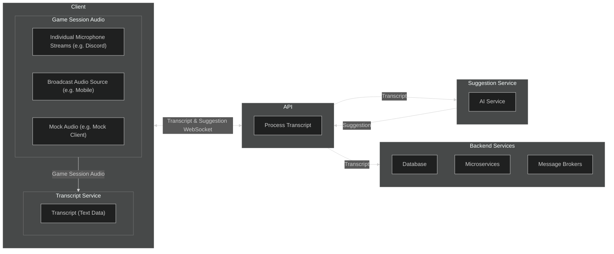

# Scrying.ai

Scrying.ai is an AI assistant for tabletop role-playing games (TTRPGs), such as *Dungeons & Dragons*, offering real-time AI suggestions and post-session summaries.

---
## Our Philosophy

This project was sparked by recent market shifts and the emerging wave of AI technology. It is first and foremost a collaborative space for contributors to update and sharpen their skills, with a focus on modern web development, DevOps, system design, and AI integration. We aim to build a professional, modern portfolio piece for everyone involved. All experience levels are welcome!

If you resonate with our vision, consider giving us a ⭐!

---

## Join the Team

We’re in **pre-development** and need contributors of any skill level. You’ll get guidance on how to start contributing immediately. 

Jump into our [Discord](https://discord.gg/rgsVa4zh) and tell us who referenced you (if any) and what interests you about the project.

To get started check out our [Onboarding Guide](https://github.com/ScryingLab/scrying.ai/wiki/Onboarding)!

---

## The Project at a Glance

### AI-Integrated Web App
- Cross-platform (browser, mobile, Discord plugin)
- Real-time UI adjustments based on game context
- SSO for persistent sessions & campaigns
- Optional billing for premium AI features

### Machine Learning & Data Challenges
- Speech transcription & speaker identification
- AI-assisted real-time mid-session suggestions (narrative hints, rules, random tables)
- AI-assisted campaign summaries and planning
- AI-driven client UI

### Internal Tooling
- AI-powered GitHub issue tracking
- Discord bots for feature visibility
- Automated documentation generation
- AI-assisted PR suggestions

### Modern DevOps & Cloud Infrastructure
- GitOps Principles
- SecOps Principles
- CI/CD pipelines with ephemeral environments
- Blue-green/canary deployment strategies
- Infrastructure as Code (IaC)
- Monitoring & observability (Prometheus, Grafana)

---

## High-Level Architecture & Data Flow Diagram

---

## Available Roles

There are many ways to contribute. Here are some highlights:

- **UX/UI Designer**
  - Craft AI-driven, real-time interfaces  
  - *Skills:* Figma, Prototyping, Accessibility  

- **Frontend Engineer**
  - Implement dashboards and AI components (React, TypeScript)  
  - *Skills:* WebSockets, Styling, UI/UX  

- **Backend Engineer**
  - Build APIs, data storage, and event-driven services (Node.js, Express, PostgreSQL)  
  - *Skills:* OpenAI API integration, microservices  

- **DevOps/Cloud Engineer**
  - Manage CI/CD, cloud infra, and security (Kubernetes, Terraform, Azure)  
  - *Skills:* Docker, GitHub Actions, Private VLAN Networking

- **AI/NLP Engineer**
  - Enhance AI descriptions, and refine prompts (OpenAI, Whisper)  
  - *Skills:* NLP, vector databases, transformers    

- **Security Engineer**
  - Implement least privilege, penetration testing, and secure AI responses  
  - *Skills:* IAM, OWASP, cloud security  

- **Technical Project Manager**
  - Define milestones, onboard contributors, track issues  
  - *Skills:* Documentation, project management, people management  

- **QA Engineer**
  - Automate tests, and ensure stability in real-time AI usage  
  - *Skills:* Cypress, Jest, API testing  

- **Internal Tooling Developer**
  - Build Discord bots, mock data endpoints, AI-assisted issue tracking  
  - *Skills:* Node.js, Discord API  

- **Product Manager / Game Design**
  - Shape user stories, TTRPG-based AI flow, pricing  
  - *Skills:* TTRPG knowledge, AI pricing models  

---

## License

This project is **open source** under the **MIT License**.
