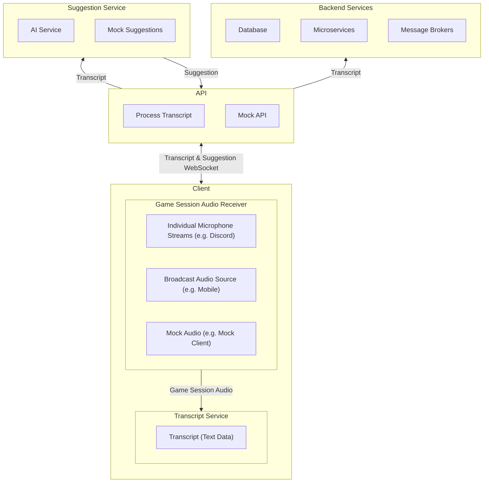

# Scrying.ai

Scrying.ai is an AI assistant for tabletop role-playing games (TTRPGs), such as *Dungeons & Dragons*, offering real-time AI suggestions and post-session summaries.

---

## Project Philosophy

This project responds to market shifts and the emerging AI wave. It’s a collaborative space for diverse skill sets to learn modern web development, DevOps, and AI integration, culminating in a portfolio piece for contributors. We welcome all experience levels to build confidence, gain real-world skills, and craft interview-ready stories.

If you resonate with our vision, consider giving us a ⭐!

---

## Join the Project

We’re in **pre-development** and need contributors of any skill level. You’ll get quick guidance on how to start contributing immediately. If interested, read on or join our Discord.

---

## The Project at a Glance

### AI-Integrated Web App
- Cross-platform (browser, mobile, Discord plugin)
- Real-time UI adjustments based on game context
- AI response display with in-game highlights
- SSO for persistent sessions
- Optional billing for premium AI features

### Machine Learning & Data
- Speech transcription & speaker identification
- Contextual AI suggestions (narrative hints, clarifications, random tables)
- AI-assisted session summaries & player insights
- Tagging for easy review & retrieval

### Internal Tooling
- AI-powered GitHub issue tracking
- Discord bots for feature visibility
- Automated documentation generation
- AI-assisted PR suggestions

### Modern DevOps & Cloud Infrastructure
- GitOps Principals
- Private Azure setup with secure networking
- CI/CD pipelines with ephemeral environments
- Blue-green / canary deployment strategies
- Infrastructure as Code (IaC)
- Monitoring & observability (Prometheus, Grafana)

---

## High-Level Architecture & Data Flow Diagram

---

## Available Roles

There are many ways to contribute. Here are some highlights:

- **UX/UI Designer**
  - Craft AI-driven, real-time interfaces  
  - *Skills:* Figma, Prototyping, Accessibility  
  - *Nice to Have:* TTRPG UI design  

- **Frontend Engineer**
  - Implement dashboards and AI components (React, TypeScript)  
  - *Skills:* WebSockets, Styling, UI/UX  
  - *Nice to Have:* Real-time app experience  

- **Backend Engineer**
  - Build APIs, data storage, event-driven services (Node.js, Express, PostgreSQL)  
  - *Skills:* OpenAI API integration, microservices  
  - *Nice to Have:* Real-time comms knowledge  

- **DevOps/Cloud Engineer**
  - Manage CI/CD, cloud infra, security (Kubernetes, Terraform, Azure)  
  - *Skills:* Docker, GitHub Actions  
  - *Nice to Have:* Cost optimization, HA setups  

- **AI/NLP Engineer**
  - Enhance AI descriptions, refine prompts (OpenAI, Whisper)  
  - *Skills:* NLP, vector databases, transformers  
  - *Nice to Have:* Domain-specific LLM tuning  

- **Security Engineer**
  - Implement least privilege, penetration testing, secure AI responses  
  - *Skills:* IAM, OWASP, cloud security  
  - *Nice to Have:* Adversarial AI testing  

- **Technical Project Manager**
  - Define milestones, onboard contributors, track issues  
  - *Skills:* Documentation, project management, people management  
  - *Nice to Have:* Open-source workflows  

- **QA Engineer**
  - Automate tests, ensure stability in real-time AI usage  
  - *Skills:* Cypress, Jest, API testing  
  - *Nice to Have:* AI-powered application testing  

- **Internal Tooling Developer**
  - Build Discord bots, mock data endpoints, AI-assisted issue tracking  
  - *Skills:* Node.js, Discord API  
  - *Nice to Have:* Chatbot & automation experience  

- **Product Manager / Game Design**
  - Shape user stories, TTRPG-based AI flow, pricing  
  - *Skills:* TTRPG knowledge, AI pricing models  
  - *Nice to Have:* Experience with game design & AI storytelling  

---

## Join Us

We’d love to have you on the team! Jump into our [Discord](https://discord.gg/m8yeFWCw) and tell us what interests you—whether it’s coding, testing, or learning. If you were referenced here by someone, please mention your name and who sent you.

---

## License

This project is **open source** under the **MIT License**.
